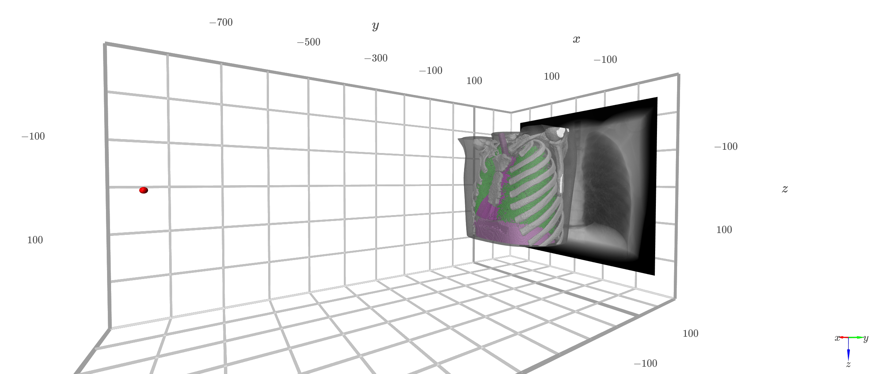

# Hands-on training: Simulating X-ray images on GPU with ](img/Logo-transparent-small.png) 



 [](http://colab.research.google.com/github/TomographicImaging/gVXR-Tutorials/blob/main)    <!--[](https://codeocean.com/capsule/CAPSULE_NUMBER_HERE/tree)--> [](https://mybinder.org/v2/gh/TomographicImaging/gVXR-Tutorials/HEAD)

## Content of this file

- Installation
    - Using Conda
    - Using pip
- Content of this repository
    - [Cheat sheet](CHEAT_SHEET.md)
    - [Test installation](notebooks/test_installation.ipynb) 
    - [First X-ray simulation](notebooks/first_xray_simulation.ipynb)
    - [3D visualisation](notebooks/visualisation.ipynb)
    - [Multi-material anatomical example](notebooks/multi_material-lungman_phantom.ipynb)
    <!-- - [Magnification](notebooks/magnification.ipynb) -->
    - [Ideal CT scan](notebooks/multi_material-CT_scan.ipynb)
    - [Low dose CT scan](notebooks/multi_material-CT_scan-low_dose.ipynb)
    - Creating, combining and moving 3D objects
    - Built-in phantoms
    - Multi-material samples using chemical elements, mixtures and compounds
    - Source types and paramaters
    - Detector paramaters
    - Realistic CT scans
    - Artefacts in CT images
    - Spectral CT imaging
    - 2D-3D registration of a clinical digital radiograph
- How to find help
- How to report bugs/request a new feature
- Q&A
- How to cite
- Research excellence
- User contributions
      
## Installation

### Using Conda

```bash
conda env create -f environment.yml
conda activate gvxr-tutorials
```

### Using pip

```bash
pip install gvxr
pip install matplotlib viewscad xpecgen spekpy SimpleITK k3d
```

## Installation Notes
1. Haoran Liu reset the VPN proxy
2. A channel has problem in the .yml file --  https://software.repos.intel.com/python/conda. It was used in cil package
   ### remove it and install cil locally later
3. create env using ```mamba env create```  instead of ```conda env create```: ```mamba env create -f environment.yml ```
4. Install cil package:
   ### 1. 克隆 CIL 仓库并切换 tag
```
git clone --recursive https://github.com/TomographicImaging/CIL.git
cd CIL
git checkout v24.3.0
git submodule update --init --recursive  # 如果这步慢就可以反复重试直到成功
```

   ### 2. 安装（开发模式或者正式安装都可）
    pip install .
   #### 或开发模式：
    pip install -e .
5. 
6. 


## Content of this repository

- [Cheat sheet](CHEAT_SHEET.md): This document list all gVXR's functions used in the tutorial notebooks. It also includes the help messages to describe the purpose of each function.
- [Test installation](notebooks/test_installation.ipynb): Run the quick test script provided with gVirtualXray's Python package to make sure the installation is working well on your system. <a href="https://colab.research.google.com/github/TomographicImaging/gVXR-Tutorials/blob/main/notebooks/test_installation.ipynb" target="_parent"></a>
- [First X-ray simulation](notebooks/first_xray_simulation.ipynb): Explore the step-by-step notebook to create our first X-ray radiograph. A mono-material object is imaged with a monochromatic source and an ideal detector. We show how to visualise the X-ray radiograph and take a screenshot of the 3D visualisation of the simulation environment. <a href="https://colab.research.google.com/github/TomographicImaging/gVXR-Tutorials/blob/main/notebooks/first_xray_simulation.ipynb" target="_parent"></a>
- [3D visualisation](notebooks/visualisation.ipynb): Get familiar with the three different 3D visualisation method provided with gVXR, i) K3D to interactively visualise the 3D scene in a Jupyter widget, ii) a customisable static 3D visualisation, and iii) an interactive 3D visualisation window. <a href="https://colab.research.google.com/github/TomographicImaging/gVXR-Tutorials/blob/main/notebooks/visualisation.ipynb" target="_parent"></a>
- [Multi-material anatomical example](notebooks/multi_material-lungman_phantom.ipynb): Using the knowledge learnt in [First X-ray simulation](notebooks/first_xray_simulation.ipynb), initialise your own simulation to create a radiograph of the Lungman phantom. <a href="https://colab.research.google.com/github/TomographicImaging/gVXR-Tutorials/blob/main/notebooks/multi_material-lungman_phantom.ipynb" target="_parent"></a>
<!-- - [Magnification](notebooks/magnification.ipynb): ADD TEXT HERE<a href="https://colab.research.google.com/github/TomographicImaging/gVXR-Tutorials/blob/main/notebooks/magnification.ipynb" target="_parent"></a> -->
- Ideal CT scan: Simulate a CT scan acquisition with gVXR and reconstruct the CT volume with CIL. As a bonus, we explore how to visualise the data in 2D using CIL's widgets, and also using 3D volume rendering with K3D. 
    - [Saving the projections on the disk prior to the reconstruction](notebooks/multi_material-CT_scan-disk.ipynb): <a href="https://colab.research.google.com/github/TomographicImaging/gVXR-Tutorials/blob/main/notebooks/multi_material-CT_scan-disk.ipynb" target="_parent"></a>
    - [Saving the projections in the RAM prior to the reconstruction](notebooks/multi_material-CT_scan-RAM.ipynb): <a href="https://colab.research.google.com/github/TomographicImaging/gVXR-Tutorials/blob/main/notebooks/multi_material-CT_scan-RAM.ipynb" target="_parent"></a>
- [Low dose CT scan](notebooks/multi_material-CT_scan-low_dose.ipynb): Simulate a low-dose CT scan acquisition with gVXR and reconstruct the CT volume with CIL using both the famous FDK algorithm and an iterative method with TV-regularisation. <a href="https://colab.research.google.com/github/TomographicImaging/gVXR-Tutorials/blob/main/notebooks/multi_material-CT_scan-low_dose.ipynb" target="_parent"></a>
- [Setting up a simulation with a JSON file](notebooks/single_material-reproducing_CT_scan-JSON_file.ipynb): We will replicate a real CT scan acquisition taking into account the source and detector properties as finely as possible. We'll use the metadata generated by the device to create a human-friendly JSON file that describes our virtual experiment. <a href="https://colab.research.google.com/github/TomographicImaging/gVXR-Tutorials/blob/main/notebooks/single_material-reproducing_CT_scan-JSON_file.ipynb" target="_parent"></a>
- [Beam hardening in CT images](notebooks/multimaterial_material-reproducing_CT_scan-JSON_file.ipynb): We will do the same as in the previous notebook, but this time with a multi-material sample, the section of electric cable. <a href="https://colab.research.google.com/github/TomographicImaging/gVXR-Tutorials/blob/main/notebooks/multi_material-reproducing_CT_scan-JSON_file.ipynb" target="_parent"></a>

- Creating, combining and moving 3D objects: Exploit gVXR built-in functionality to create our own model by combining spheres, cuboids and cylinders.
- Built-in phantoms: spheres in cylinders, foam, step wedge
- Multi-material samples using chemical elements, mixtures and compounds
- Source types and paramaters: Differentiate between source types (parallel beam, e.g. synchrotron, and cone-beam, e.g. X-ray tube). For X-ray tube add extra levels of realism with the focal spot and polychromatic spectrum. Introduce the notion of magnification to compute the pixel size in radiography.
- Detector paramaters: Revisit the notion of pixel size and add extra levels of realism with the point spread function and scintillator material.
- Realistic CT scans: Using some of the knowledge learnt in the notebooks above, create realistic CT scan acquisitions for both synchrotron and labCT.
- Artefacts in CT images: Explore the common source of artefact in CT images:
    - For **aliasing artefacts**, you may look at [Ideal CT scan](notebooks/multi_material-CT_scan.ipynb) where the number of projections was far too low.
    - For **low dose** CT scans, you may look at [Low dose CT scan](notebooks/multi_material-CT_scan-low_dose.ipynb) where you can control the noise level and the number of projections.
- Spectral CT imaging:
- 2D-3D registration of a clinical digital radiograph:
- Laminography:
- Helical CT scans:


## How to find help

- Email me (Franck P. Vidal, STFC);
- Raise an issue on GitHub: [https://github.com/TomographicImaging/gVXR-Tutorials/issues](https://github.com/TomographicImaging/gVXR-Tutorials/issues)
- Open a ticket on SourceForge: [https://sourceforge.net/p/gvirtualxray/tickets](https://sourceforge.net/p/gvirtualxray/tickets);
- Use the forum on SourceForge: [https://sourceforge.net/p/gvirtualxray/discussion/](https://sourceforge.net/p/gvirtualxray/discussion/);
- Subscribe to the mailing list: [https://sourceforge.net/projects/gvirtualxray/lists/gvirtualxray-discuss](https://sourceforge.net/projects/gvirtualxray/lists/gvirtualxray-discuss)
- Check the technical documentation, e.g. calling `help(gvxr)` for help on the Python package or something like `help(gvxr.createNewContext)` for a specific function.
- Look at the [cheat sheet](CHEAT_SHEET.md) that lists all the gVXR's functions used in the tutorial notebooks. It also includes the help messages to describe the purpose of each function.

## How to report bugs or request a new feature

- Email me (Franck P. Vidal, STFC);
- Raise an issue on GitHub: [https://github.com/TomographicImaging/gVXR-Tutorials/issues](https://github.com/TomographicImaging/gVXR-Tutorials/issues)
- Open a ticket on SourceForge: [https://sourceforge.net/p/gvirtualxray/tickets](https://sourceforge.net/p/gvirtualxray/tickets);
- Use the forum on SourceForge: [https://sourceforge.net/p/gvirtualxray/discussion/](https://sourceforge.net/p/gvirtualxray/discussion/);

## Q&A

See [Q&A](QnA.md).

## How to cite

If you use gVXR in your own applications, particularly for research & development, I will be grateful if you could cite the articles as follows:

- **Seminal paper**: Vidal, F. P., Garnier, M., Freud, N., Létang, J. M., and John, N. W., “Simulation of x-ray attenuation on the GPU,” in [Proceedings of Theory and Practice of Computer Graphics 2009](https://diglib.eg.org/collections/916dfc7f-8278-428f-9ae3-c85aeff29595), 25–32, [Eurographics Association](https://www.eg.org/), Cardiff, UK (June 2009). DOI: [10.2312/LocalChapterEvents/TPCG/TPCG09/025-032](https://doi.org/10.2312/LocalChapterEvents/TPCG/TPCG09/025-032)
- **First reference to gVXR as an opensource software**: Vidal, F. P. and Villard, P.-F., “Development and validation of real-time simulation of x-ray imaging with respiratory motion,” Computerized Medical Imaging and Graphics 49, 1–15 (2016). DOI: [10.1016/j.compmedimag.2015.12.002](https://doi.org/10.1016/j.compmedimag.2015.12.002)
- **Clinical validation study**: Pointon, J. L., Wen, T., Tugwell-Allsup, J., Sújar, A., Létang, J. M., and Vidal, F. P., “Simulation of x-ray projections on gpu: Benchmarking gvirtualxray with clinically realistic phantoms,” Computer Methods and Programs in Biomedicine 234, 107500 (2023). DOI: [10.1016/j.cmpb.2023.107500](https://doi.org/10.1016/j.cmpb.2023.107500)
- **Review paper on CT applications**: Vidal, F. P., Afshari, S., Ahmed, S., Atkins, C. Béchet, E., Bellot, A., Bosse, S., Chahid, Y., Chou, C.-Y., Culver, R., Dixon, L., Friemann, J., Garbout, A., Hatton, C., Henry, A., Leblanc, C., Leonardi, A., Létang, J. M., Lipscomb, H., Manchester, T., Meere, B., Middleburgh, S., Mitchell, I., Perera, L., Puig, M., and Tugwell-Allsup, J., “X-ray simulations with gVXR as a useful tool for education, data analysis, set-up of CT scans, and scanner development,” in [Developments in X-Ray Tomography XV, SPIE Optics & Photonics](https://doi.org/10.1117/12.3025315), Volume 13152, [SPIE](https://spie.org/), San Diego, California, United States (Aug 2024). DOI: [10.1117/12.3025315](https://doi.org/10.1117/12.3025315)

## User contributions on our website

We'd like to share user contributions in a new section of gVXR's website [https://gvirtualxray.sourceforge.io/](https://gvirtualxray.sourceforge.io/). If you'd like to showcase your work, please contact me by email (Franck P. Vidal, STFC) or raise an issue on GitHub ([https://github.com/TomographicImaging/gVXR-Tutorials/issues](https://github.com/TomographicImaging/gVXR-Tutorials/issues)).


<!--
- Session 1
    - [Notebook 0](00-warming-up.ipynb) -- Warming up
        - Log in;
        - Copy the training data;
        - Install the Python packages needed for this course;
        - Check that [gVirtualXray](https://gvirtualxray.sourceforge.io/) is working well;
        - Verify which version of [gVirtualXray](https://gvirtualxray.sourceforge.io/) is installed (software and hardware);
        - How to get help (during and after the training).
    - [Notebook 1](01-Introduction-to-Xray-attenuation.ipynb) -- Introduction to X-ray attenuation and its implementation in [gVirtualXray](https://gvirtualxray.sourceforge.io/)
        - Explain what gVXR is and why it has been developed;
        - Introduce projection X-ray imaging and how X-rays are produced;
        - Understand how X-rays interact with matter;
        - Become familiar with the Beer-Lambert law to compute the attenuation of X-rays by matter;
        - Describe how the Beer-Lambert law is implemented in [gVirtualXray](https://gvirtualxray.sourceforge.io/);
        - Compare images simulated using [gVirtualXray](https://gvirtualxray.sourceforge.io/) with ground truth images.
- Session 2
    - [Notebook 2](02-first_xray_simulation.ipynb) -- First X-ray radiograph simulations
        - Create our first X-ray simulation, step-by-step;
        - Save our X-ray image in a file format that preserves the original dynamic range;
        - Visualise the results with 3 different look-up tables;
        - Visualise the 3D environment.
    - [Notebook 3](03-multi_material_sample.ipynb) -- Multi-material samples
        - Chemical elements
        - Mixtures
        - Compounds
- Session 3
    - [Notebook 4](04-source_parameters.ipynb) -- Source types and paramaters
        - Parallel beam (synchrotron)
        - Cone-beam (X-ray tube)
        - Focal spot
        - Polychromatic spectrum
        - Pixel size, magnification
    - Preview: watch out for new release with photonic noise model
    - [Notebook 5](05-detector_parameters.ipynb) -- Detector paramaters
        - Pixel size (revisited)
        - Point spread function
        - Energy response of the detector
- Session 4
    - [Notebook 6](06-CT_acquisition.ipynb) -- Simulating CT scans
        - Parallel beam
        - Cone beam
        - Monochromatic spectrum
        - Polychromatic spectrum
    - [Notebook 7](07-2D_registration_Xray_radiograph.ipynb) -- Using simulations for image registration
<!--     - [Notebook 8](08-3D_registration_Xray_CT.ipynb) -->
<!--


- 12:30 – Lunch
- 13:30 – Session 3 (1 hour 15 minutes)
    - gVXR: More advanced simulations
            - Polychromatic spectrum  (faut parler de l'influence des kV et mA, de l'utilisation de filtres et du type d'anode (W, Mo, Cu...).)  Pour le 5 et 8, il serait bien de montrer à exposition constante (mAs) l'influence de la taille du pixel.
            - Photonic noise
- 14:45 – Coffee
- 15:15 – Session 4 (1 hour 45 minutes)
    - gVXR: Simulation of tomography acquisition
        1. parallel
        2. cone beam
        3. monochromatic
        4. polychromatic
        5. noisy
        6. noiseless
    - gVXR: Image registration
- 17:00 – End -->
